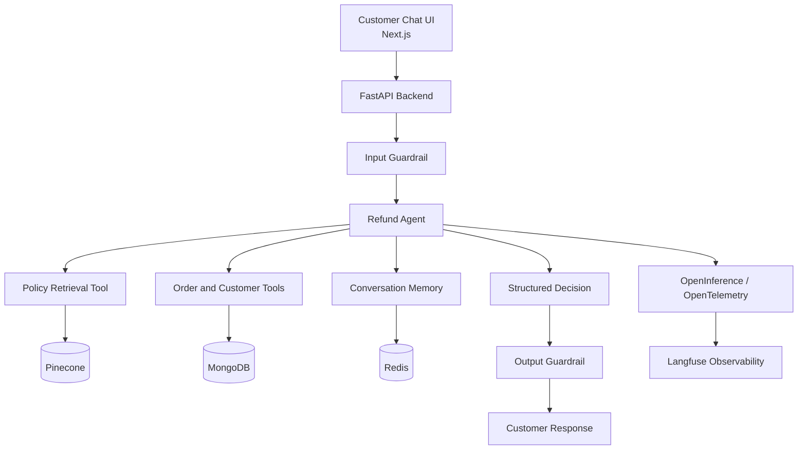
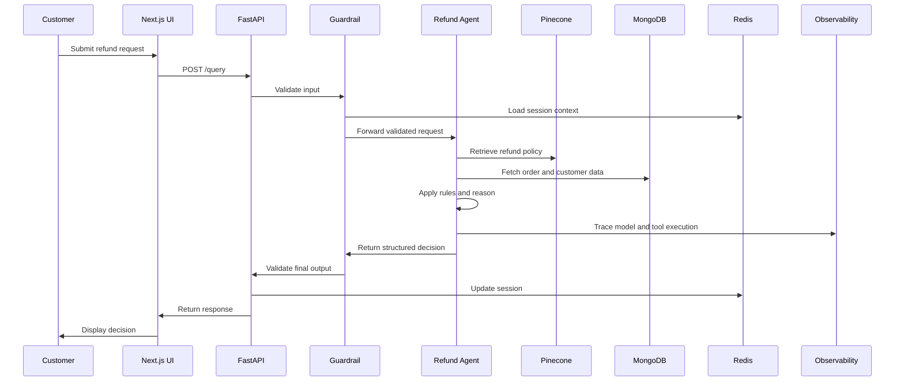

<div align="center">

# 🤖 AuraGear AI Refund Agent

### Production-oriented refund automation with hybrid RAG, structured decisioning, guardrails, and observability

<p>
  <a href="https://drive.google.com/file/d/1IsBMHvM7bE1eF3cGJreJt_27cZf64qxC/view?usp=sharing">
    
  </a>
  <a href="https://github.com/Manyfaces860/end_to_end_refund_agent">
    
  </a>
</p>

<p>
  
  
  
  
  
  
  
  
  
</p>

<p>
  <a href="#-overview">Overview</a> •
  <a href="#-demo">Demo</a> •
  <a href="#-core-capabilities">Capabilities</a> •
  <a href="#-architecture">Architecture</a> •
  <a href="#-getting-started">Getting started</a>
</p>

</div>

---

## 🌍 Overview

**AuraGear AI Refund Agent** is a full-stack customer-support system that evaluates refund requests using a controlled combination of:

- large-language-model reasoning
- explicit refund rules
- retrieval-augmented generation
- structured output schemas
- programmatic tools
- input and output guardrails
- persistent conversation state
- execution tracing and observability

The project is built around a fictional commerce organisation named **AuraGear**.

Instead of behaving like a general-purpose chatbot, the agent follows a structured workflow:

1. understand the customer request
2. gather missing information
3. retrieve the relevant refund policy
4. inspect customer, order, and product data
5. apply business constraints
6. return a controlled decision
7. escalate high-risk cases to a human

---

## 🎥 Demo

<div align="center">

### Watch the complete application walkthrough

<a href="https://drive.google.com/file/d/1IsBMHvM7bE1eF3cGJreJt_27cZf64qxC/view?usp=sharing">
  
</a>

<br/><br/>

The demo shows the customer chat experience, multi-turn refund handling, policy-grounded decisions, and the end-to-end agent workflow.

</div>

> GitHub does not directly play Google Drive videos inside a README, so the button opens the demo in Google Drive.

---

## ✨ Core capabilities

<table>
<tr>
<td width="50%" valign="top">

### 🧠 Agentic decisioning

Uses the OpenAI Agents SDK to coordinate reasoning, tool usage, policy retrieval, and structured refund decisions.

</td>
<td width="50%" valign="top">

### 🔍 Hybrid RAG

Retrieves policy context using dense semantic retrieval and keyword-aware search through Pinecone.

</td>
</tr>

<tr>
<td width="50%" valign="top">

### 🛡️ Input and output guardrails

Checks user requests before execution and validates agent responses before they reach the customer.

</td>
<td width="50%" valign="top">

### 🧾 Structured outputs

Produces controlled decisions such as approved, denied, escalated, or more information required.

</td>
</tr>

<tr>
<td width="50%" valign="top">

### 💬 Stateful conversations

Maintains session context so customers can provide missing details over multiple messages.

</td>
<td width="50%" valign="top">

### 📊 Full observability

Traces model calls, agent runs, tool execution, latency, token usage, and failures through Langfuse and OpenTelemetry-compatible instrumentation.

</td>
</tr>
</table>

---

## 🏛️ Refund decisions

The agent returns one of four controlled outcomes:

| Decision | Meaning |
|---|---|
| `APPROVED` | The request satisfies the refund policy |
| `DENIED` | The request violates one or more policy conditions |
| `ESCALATE` | The request requires human review |
| `NEEDS_MORE_INFORMATION` | The agent cannot decide safely without more details |

A structured result can include:

```json
{
  "decision": "ESCALATE",
  "customer_message": "Your request requires manual review.",
  "reasoning_summary": "The order exceeds the automatic refund threshold.",
  "refund_amount": null,
  "restocking_fee": null,
  "conversation_summary": "Customer requested a refund for order AG-1024."
}
```

---

## 📋 Business rules represented

<table>
<tr>
<td width="50%" valign="top">

### ✅ Eligibility checks

- standard return window
- delivery-date validation
- Black November extension
- eligible order status
- product condition checks

</td>
<td width="50%" valign="top">

### 🚫 Automatic denial

- final-sale products
- opened or activated software
- customer-caused damage
- expired refund window

</td>
</tr>

<tr>
<td width="50%" valign="top">

### ⚠️ Human escalation

- high-value refund requests
- flagged customer accounts
- ambiguous policy conflicts
- sensitive transaction cases

</td>
<td width="50%" valign="top">

### ❓ Information gathering

- missing order number
- missing delivery date
- unclear damage status
- incomplete product details

</td>
</tr>
</table>

---

## 🧱 Architecture



### Component view

<table>
<tr>
<td width="33%" valign="top">

### Frontend

- Next.js 16
- React 19
- TypeScript
- Tailwind CSS
- conversational chat UI

</td>
<td width="33%" valign="top">

### Backend

- FastAPI
- OpenAI Agents SDK
- Pydantic schemas
- Beanie ODM
- tool orchestration
- guardrail execution

</td>
<td width="33%" valign="top">

### Infrastructure

- MongoDB
- Redis
- Pinecone
- Docker Compose
- Terraform
- Google Cloud
- Langfuse

</td>
</tr>
</table>

---

## 🔄 End-to-end request flow



---

## 🧰 Tooling and safeguards

### Agent tools

The agent can use explicit programmatic tools for:

- policy retrieval
- order lookup
- customer lookup
- product inspection
- eligibility checks
- refund calculation
- escalation handling

### Guardrails

The system is designed to detect and block:

- prompt injection attempts
- attempts to override refund policy
- unrelated or unsupported requests
- malformed structured output
- unsafe financial actions
- hallucinated order information

### Observability

The tracing layer can monitor:

- model latency
- tool-call duration
- token consumption
- retrieved policy context
- guardrail failures
- decision distribution
- escalation frequency
- execution errors

---

## 🛠️ Tech stack

| Layer | Technology |
|---|---|
| Frontend | Next.js 16, React 19, TypeScript, Tailwind CSS |
| Backend | FastAPI, Uvicorn, Pydantic |
| Agent framework | OpenAI Agents SDK |
| Database | MongoDB, Motor, Beanie |
| Session state | Redis |
| Retrieval | Pinecone hybrid search |
| LLM integration | OpenAI |
| Observability | Langfuse, OpenInference, OpenTelemetry |
| Testing | Pytest |
| Containers | Docker, Docker Compose |
| Infrastructure | Terraform, Google Cloud |

---

## 📂 Repository structure

```text
end_to_end_refund_agent/
├── backend/
│   ├── agents/               Agent definitions and orchestration
│   ├── guardrails/           Input and output guardrails
│   ├── models/               Database and response schemas
│   ├── routes/               FastAPI endpoints
│   ├── services/             Application and business services
│   ├── tools/                Agent-callable tools
│   ├── tests/                Backend test suite
│   ├── Dockerfile
│   └── requirements.txt
│
├── frontend/
│   ├── app/                  Next.js application routes
│   ├── components/           Chat and UI components
│   ├── Dockerfile
│   └── package.json
│
├── terraform/                Infrastructure-as-code
├── docker-compose.yml
└── README.md
```

---

## 🔌 API usage

### Request

```http
POST /query
Content-Type: application/json
```

```json
{
  "query": "I want a refund for order AG-1024.",
  "session_key": "optional-existing-session-key"
}
```

### Response

```json
{
  "message": "Your request requires manual review because the order value exceeds the automatic refund limit.",
  "refund": {
    "decision": "ESCALATE",
    "refund_amount": null,
    "restocking_fee": null
  },
  "session_key": "generated-or-existing-session-key"
}
```

Interactive API documentation is available at:

```text
http://localhost:8000/docs
```

---

## 🚀 Getting started

### Prerequisites

Install:

- Git
- Docker
- Docker Compose

You will also need credentials for the services enabled in your environment:

- OpenAI
- MongoDB
- Redis
- Pinecone
- Langfuse
- Google Cloud

### Clone the repository

```bash
git clone https://github.com/Manyfaces860/end_to_end_refund_agent.git
cd end_to_end_refund_agent
```

### Configure the backend

Create a backend environment file using the variables required by your implementation.

Example:

```env
OPENAI_API_KEY=your_openai_api_key

MONGODB_URI=your_mongodb_connection_string
DATABASE_NAME=refund_agent

REDIS_URL=your_redis_connection_string

PINECONE_API_KEY=your_pinecone_api_key
PINECONE_INDEX_NAME=your_policy_index

LANGFUSE_PUBLIC_KEY=your_langfuse_public_key
LANGFUSE_SECRET_KEY=your_langfuse_secret_key
LANGFUSE_HOST=your_langfuse_host
```

### Configure the frontend

```env
NEXT_PUBLIC_API_URL=http://localhost:8000
```

> Never commit real API keys, database credentials, or cloud service-account files.

### Run the complete application

```bash
docker compose up --build
```

| Service | Local address |
|---|---|
| Frontend | `http://localhost:3000` |
| Backend | `http://localhost:8000` |
| Swagger documentation | `http://localhost:8000/docs` |

### Stop the services

```bash
docker compose down
```

---

## 💻 Run locally without Docker Compose

### Backend

```bash
cd backend
python -m venv .venv
```

Activate the virtual environment.

macOS or Linux:

```bash
source .venv/bin/activate
```

Windows PowerShell:

```powershell
.venv\Scripts\Activate.ps1
```

Install dependencies:

```bash
pip install -r requirements.txt
```

Start the API:

```bash
uvicorn main:app --reload --port 8000
```

### Frontend

```bash
cd frontend
npm install
npm run dev
```

---

## 🧪 Testing

Run the backend tests:

```bash
cd backend
pytest
```

Recommended test scenarios:

- valid standard refund
- expired return window
- final-sale product
- customer-caused damage
- Black November restocking fee
- flagged customer escalation
- high-value refund escalation
- missing order information
- prompt injection
- malformed model output
- tool failure
- retrieval failure

---

## 🐳 Docker services

The root `docker-compose.yml` starts:

<table>
<tr>
<td width="50%" valign="top">

### Backend

- built from `backend/Dockerfile`
- exposed on port `8000`
- FastAPI application
- backend source mounted for development

</td>
<td width="50%" valign="top">

### Frontend

- built from `frontend/Dockerfile`
- exposed on port `3000`
- configured to call the backend service
- starts after the backend dependency

</td>
</tr>
</table>

---

## ☁️ CI/CD and deployment

The deployment workflow runs on pushes to `main` only when files change inside:

```text
backend/**
frontend/**
terraform/**
```

This means a root-level README-only change does not trigger the deployment pipeline.

The infrastructure layer uses Terraform to keep cloud configuration reproducible and version controlled.

---

## 🔐 Security considerations

This project demonstrates safer patterns for AI-assisted financial workflows:

- structured decisions instead of unrestricted text
- policy-grounded retrieval
- explicit tool access
- input and output guardrails
- automatic escalation for sensitive cases
- session-scoped context
- execution tracing
- environment-based secret configuration

A real production system would additionally require:

- authentication and authorisation
- audit logging
- encrypted storage
- secret rotation
- rate limiting
- fraud detection
- role-based access control
- human approval for financial transactions
- data-retention policies

---

## 🗺️ Roadmap

- [x] Full-stack conversational interface
- [x] FastAPI agent backend
- [x] Structured refund decisions
- [x] Hybrid policy retrieval
- [x] Persistent conversation sessions
- [x] Input and output guardrails
- [x] Docker Compose setup
- [x] Agent tracing and observability
- [x] Infrastructure-as-code structure
- [ ] Human-review dashboard
- [ ] Role-based access control
- [ ] Expanded automated evaluation suite
- [ ] Policy versioning
- [ ] Load and failure testing
- [ ] Production security hardening

---

## 👤 Author

<div align="center">

### Abhishek Gupta

<p>
  <a href="https://github.com/Manyfaces860">
    
  </a>
  <a href="https://www.linkedin.com/in/abhishek-gupta-ab377b305/">
    
  </a>
</p>

</div>

---

<div align="center">

### Safe decisions. Grounded policies. Observable execution.

<a href="https://drive.google.com/file/d/1IsBMHvM7bE1eF3cGJreJt_27cZf64qxC/view?usp=sharing">
  
</a>

</div>
